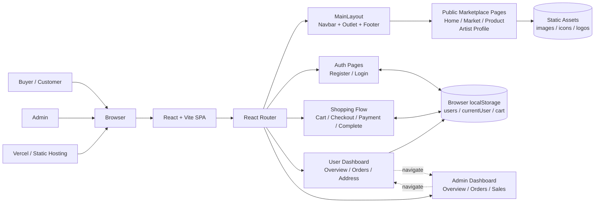
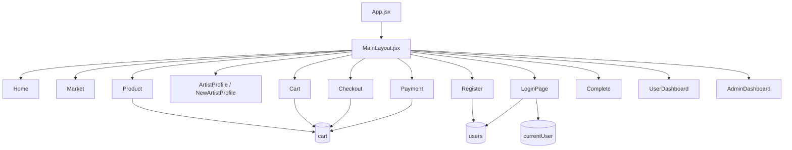

# Creative Market System Diagram

เอกสารนี้สรุป architecture ของโปรเจค `creative-market-front-end-sprint-2` จากโค้ดปัจจุบันใน repo

## High-Level System Diagram

## Internal Module View

## Notes

- โปรเจคนี้เป็น `frontend-only SPA` ในสถานะปัจจุบัน ยังไม่มี backend API หรือ database server อยู่ใน repo
- การเก็บข้อมูลหลักตอนนี้ใช้ `localStorage`:
  - `users` สำหรับสมัครสมาชิก
  - `currentUser` สำหรับ session หลัง login
  - `cart` สำหรับตะกร้าสินค้าและ checkout flow
- หน้า `UserDashboard` และ `AdminDashboard` เป็น UI module ภายในแอปเดียวกัน และสลับกันด้วยการ `navigate()`
- มีหน้า/คอมโพเนนต์ฝั่ง artist เช่น `ArtistDrop` และ `ArtistRegister` อยู่ใน repo แต่ยังไม่ได้ผูก route ใน `src/App.jsx`

## Suggested Presentation Caption

> Creative Market ใช้สถาปัตยกรรมแบบ Frontend SPA บน React + Vite ให้ผู้ใช้และแอดมินใช้งานผ่าน Browser เดียวกัน โดยจัดการ routing ภายในแอปด้วย React Router และเก็บข้อมูลจำลอง เช่น ผู้ใช้ปัจจุบันและตะกร้าสินค้า ไว้ใน browser localStorage
